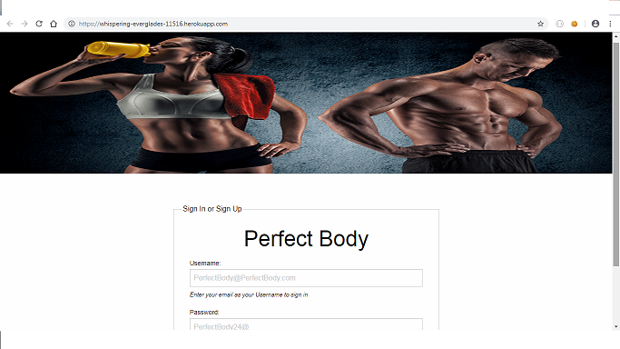
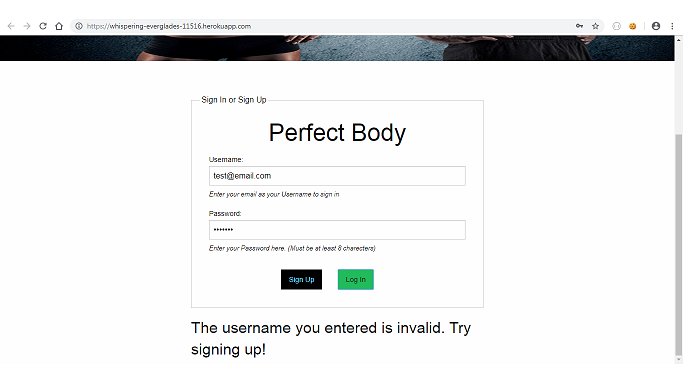
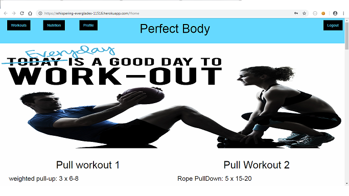
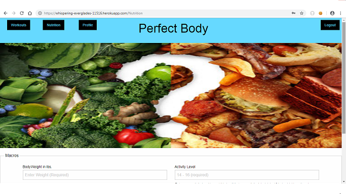
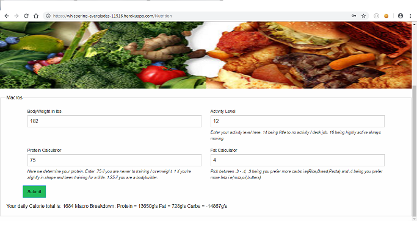

# perfect-body
Project 3
# Overview
This app is to help the people that not go to the gym because they do not know what workout to do and also which diet follow.
This app will show different workouts to be able to perform at the gym and some nutitional information for healthy diet.
The users have to create an account to have access to the workout.
(can be able to add some new workouts for others users to try, and to save workouts and diet to do)
This is the login page where users are able to sing up or sing in

If user try to login without an account it will show this messaje

When user login with their account will display the workouts

also user can go to the nutrition from the workout page

The nutrition page give a macrocalculation for the diet to follow

# Technologies used:

### React
### ES6
### Bcrypt
### CSS
### Trello
### Foundation (CSS)
### Heroku to deploy the app
### Mongodb
### mongoose

# Website
https://whispering-everglades-11516.herokuapp.com/

# You can see the app code on the following link
https://github.com/Yeiska/perfect-body

